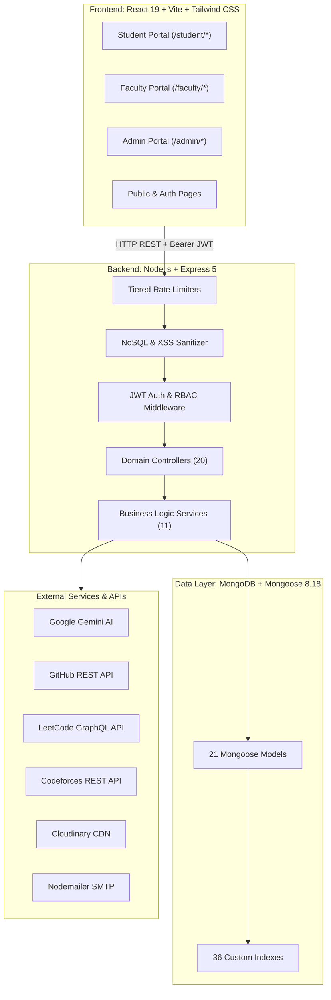
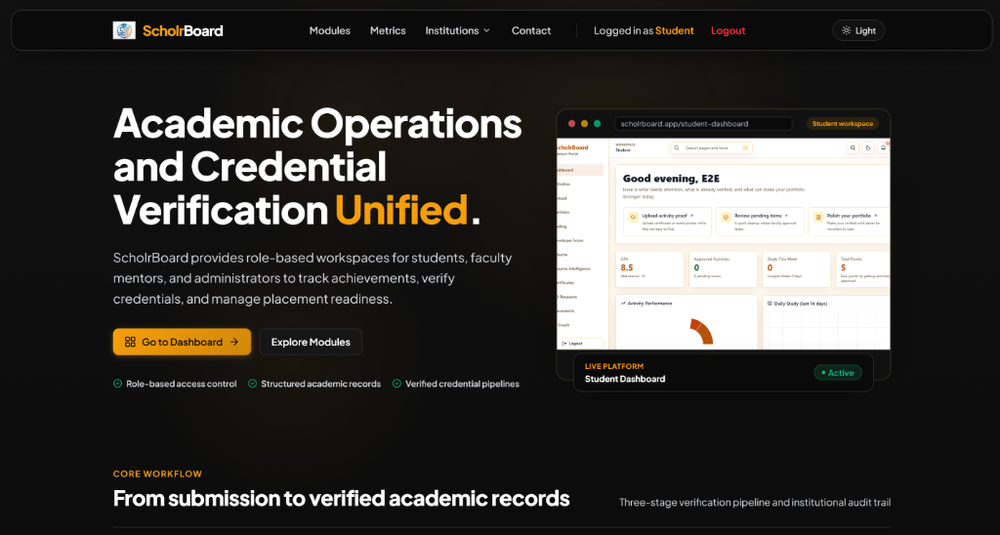
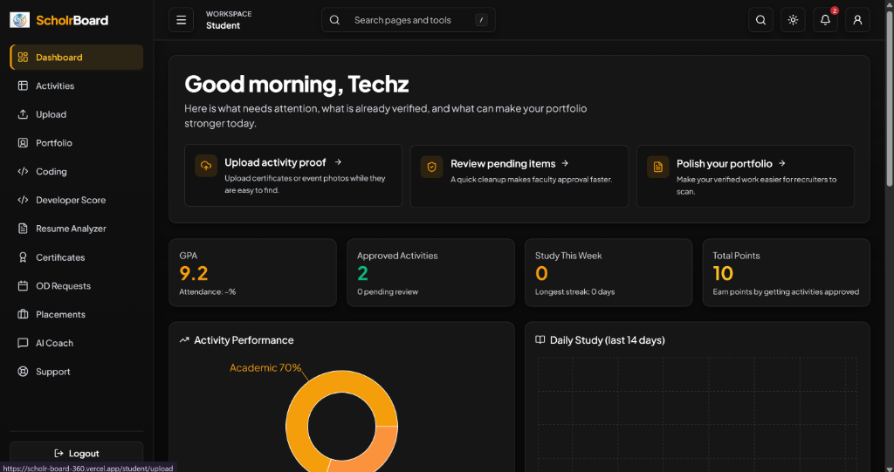
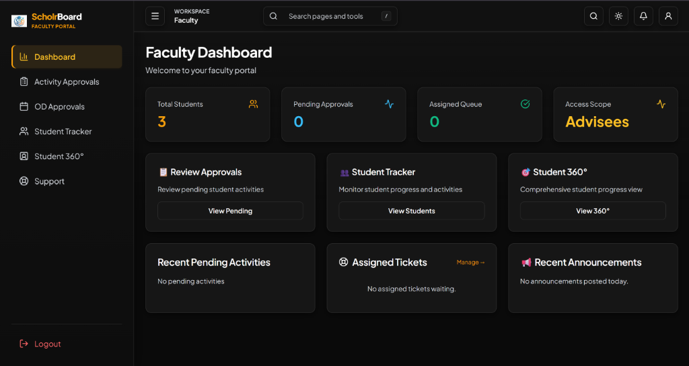
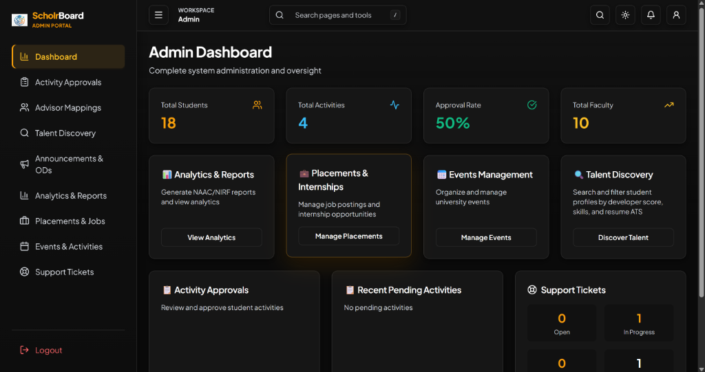
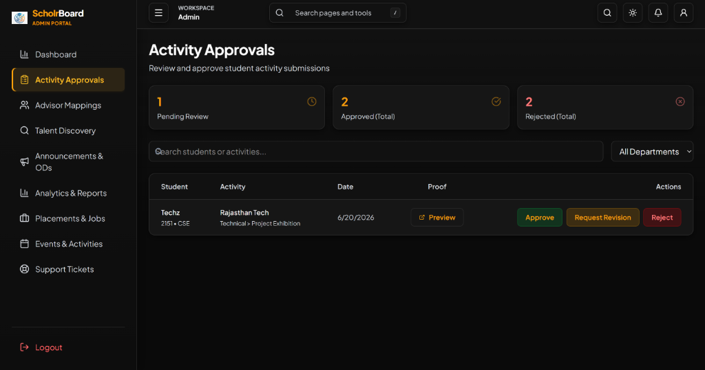
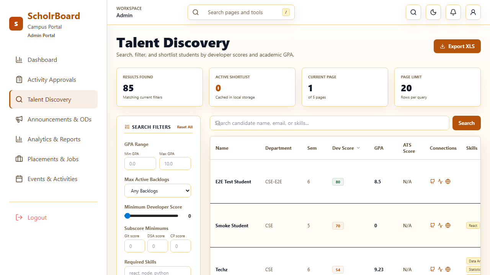

# ScholrBoard

Full-stack academic operations, credential verification, and student portfolio management system.

[](https://nodejs.org)
[](https://react.dev)
[](https://expressjs.com)
[](https://www.mongodb.com)
[](https://tailwindcss.com)
[](https://playwright.dev)
[](LICENSE)

---

## Overview

ScholrBoard is a web application designed to manage student credentials, extracurricular achievement verification, and placement readiness across universities and colleges.

### The Problem
Colleges and universities often track extracurricular activities, certifications, coding profiles, on-duty attendance, and placement preparation across disconnected spreadsheets, paper records, and Google Forms. This causes administrative bottlenecks, unverified resume claims, delayed faculty reviews, and slow institutional reporting for accreditation frameworks such as NAAC and NIRF.

### The Solution
ScholrBoard provides a role-based platform with distinct interfaces for students, faculty advisors, department coordinators, and administrators. It implements structured activity submission queues with atomic database updates, automated developer profile aggregation across coding platforms, AI-assisted resume evaluation, and an index-optimized talent discovery search engine.

---

## Core Modules

ScholrBoard provides 4 role-scoped workspaces:

### 1. Student Portal (`/student/*`)
* **Academic Overview**: View cumulative GPA, attendance percentages, and profile completeness recommendations.
* **Activity Logging**: Submit hackathons, certifications, research publications, internships, and workshop proofs with document attachments for faculty review.
* **Developer Scoring**: Synchronize public statistics from GitHub, LeetCode, and Codeforces to calculate a unified developer score.
* **Resume Analyzer**: Upload PDF or DOCX resumes for ATS compatibility scoring, keyword gap analysis, and section feedback using Google Gemini AI.
* **Digital Portfolio**: Assemble verified activities and technical skills into a shareable web portfolio with client-side PDF export (`jsPDF` / `html2canvas`).
* **On-Duty (OD) Requests**: Submit and track attendance leave requests for academic and technical events.
* **Placement Drives**: Browse institutional placement drives, verify eligibility criteria, and submit applications.
* **Support**: Submit and track academic and technical helpdesk tickets.

### 2. Faculty Advisor Portal (`/faculty/*`)
* **Advisee Roster**: View academic standing, GPA records, and activity histories for assigned students.
* **Activity Verification Queue**: Review pending student activity submissions in FIFO order with Approve, Reject, or Request Revision actions.
* **Student 360 View**: Inspect individual student records, verified credentials, and linked coding platform metrics.
* **On-Duty Approvals**: Evaluate and approve student OD attendance requests with audit-logged feedback.
* **Advisee Support Tickets**: Review and respond to support inquiries submitted by assigned students.

### 3. Department Coordinator Portal (`/faculty/*` with Coordinator Level)
* **Department Analytics**: Track verification throughput, review queues, and submission trends across the department.
* **Faculty Review Oversight**: Monitor review turnaround times and activity distribution across department faculty advisors.
* **Cohort Metrics**: Analyze placement readiness and academic distribution across student batches and sections.

### 4. Administrator Portal (`/admin/*`)
* **Talent Discovery Engine**: Filter student profiles by developer score, GPA, competitive programming ratings, and technical skills for placement drives.
* **Placement Management**: Create, publish, and close campus recruitment opportunities with department, GPA, and backlog criteria.
* **Event Management**: Create and manage institutional hackathons, seminars, and technical workshops with attendee registration limits.
* **Announcements**: Publish department-scoped or campus-wide notices.
* **Advisor Allocation**: Map students to faculty advisors individually or in bulk.
* **Support Ticket Triage**: Assign, reassign, and resolve support tickets across departments.

---

## Key Workflows

### 1. Student Activity Submission and Review
1. The student submits an activity with title, category, date, organization, and proof file URL (uploaded to Cloudinary).
2. The submission enters the assigned faculty advisor's verification queue in `Pending` status.
3. The faculty advisor inspects the proof and selects `Approve`, `Reject`, or `Revise`.
4. When approved, a multi-document MongoDB transaction calculates category points via `scoringService.js`, increments the student's cumulative points, creates an immutable audit record in `AuditLog`, and dispatches an in-app notification to the student.

### 2. Developer Profile Synchronization and Scoring
1. The student provides public profile handles for GitHub, LeetCode, and Codeforces.
2. The student triggers synchronization via `/api/developer/sync/*`.
3. An atomic lock (`syncLockService.js`) prevents concurrent sync calls for the profile.
4. Backend service adapters fetch public profile metrics from external APIs, compute component sub-scores, calculate the composite developer score, update the student's `Profile` record, and release the lock.

### 3. Talent Discovery and Placement Filtering
1. Administrators access the talent discovery interface (`/admin/talent-discovery`).
2. Search queries apply criteria for minimum developer score, GPA range, minimum LeetCode rating, and skill keywords.
3. The backend executes a Profile-first aggregation pipeline that leverages the compound index on `{ developerScore: -1, gpa: -1 }` before paginating and joining user data.
4. Filtered candidate rosters can be exported as Excel spreadsheets (`.xlsx`).

### 4. On-Duty (OD) Leave Management
1. The student submits an OD request with date range, reason, event details, and document proof.
2. The request appears in the faculty advisor's OD approval queue.
3. The advisor approves or rejects the request with an optional remark.
4. The system logs the decision and updates the student's attendance record.

---

## Architecture



---

## Technical Highlights

### 1. Unified Developer Scoring Engine
The platform implements an automated scoring algorithm (`server/services/developerScoringService.js`) that normalizes metrics across multiple coding platforms into a 0–100 developer score:

$$\text{Unified Score} = \min\left(100, \frac{0.30 \cdot S_{\text{GH}} + 0.35 \cdot S_{\text{DSA}} + 0.20 \cdot S_{\text{CP}}}{\text{Active Weight Sum}} + \text{Bonus}_{\text{Academic}} + \text{Bonus}_{\text{Readiness}}\right)$$

* **GitHub Sub-Score ($S_{\text{GH}}$)**: Evaluates repository count (20%), stars with logarithmic scaling (40%), forks with logarithmic scaling (20%), followers (10%), and topic keywords (10%).
* **LeetCode Sub-Score ($S_{\text{DSA}}$)**: Evaluates easy problems (20%), medium and hard problems weighted 2.5x (30%), and contest rating scaled from 1,000 to 2,000 (50%).
* **Codeforces Sub-Score ($S_{\text{CP}}$)**: Evaluates contest rating scaled from 800 to 2,000, combined with an activity decay multiplier based on the last contest date ($>6\text{ months}: 0.90\times$, $>12\text{ months}: 0.75\times$, $>24\text{ months}: 0.50\times$).
* **Dynamic Re-weighting**: If a student links only 1 or 2 platforms, the denominator adjusts to the sum of active platform weights, avoiding score penalization for unlinked platforms.
* **Concurrency Locking**: Distributed locking (`server/services/syncLockService.js`) prevents duplicate simultaneous sync requests and reclaims expired locks after 10 minutes.

### 2. Talent Discovery Query Optimization
In `server/controllers/talentDiscoveryController.js`, the talent search aggregation pipeline is optimized for index efficiency:
* **Pipeline Design**: Aggregation starts on the `Profile` collection instead of `User`, allowing the `$sort` stage on `developerScore` to use the compound B-tree index `{ developerScore: -1, gpa: -1 }` (`IXSCAN`) before joining user identity data via `$lookup`.
* **Benchmark Results**: Benchmarking scripts (`server/scripts/benchmarkTalentDiscovery.js`) demonstrate execution times of 42 ms at 10,000 synthetic records compared to 2,340 ms for an unindexed post-lookup sort (98.2% latency reduction).

### 3. ACID Activity Approval Workflow
To prevent partial state updates during activity review:
* **Rule-Based Points**: Point allocations follow category rules in `server/services/scoringService.js` (Patent: 50 pts, Research Paper: 30 pts, Hackathon Winner: 25 pts, Internship: 20 pts, Certification: 10 pts, Workshop: 5 pts).
* **Atomic Transactions**: Multi-document operations run inside `withTransaction.js`, ensuring activity status update, points recalculation, audit log persistence, and notification dispatch commit together.

### 4. Multi-Model AI Service Fallback
Google Gemini AI services in `server/controllers/aiController.js` implement a fault-tolerant request pipeline:
* **Fallback Hierarchy**: Automatically cascades through models if a provider fails or rate-limits: `GEMINI_MODEL` -> `gemini-flash-lite-latest` -> `gemini-2.5-flash` -> `gemini-2.0-flash`.
* **Retry Strategy**: Up to 3 retry attempts per model with exponential backoff ($1000\text{ ms} \times 2^{\text{attempt}-1}$).
* **Document Parsers**: Extracts structured text from uploaded PDF resumes (`pdf-parse`) and Word documents (`mammoth`) before schema-validated JSON extraction.

### 5. Multi-Layer Security Controls
1. **Stateless JWT Authentication**: Signed Bearer token validation on all protected routes.
2. **Password Hashing**: 10-round salted bcrypt hashing with `select: false` on user password fields.
3. **Declarative RBAC**: Route middleware enforcing role boundaries (`student`, `faculty`, `admin`).
4. **Relationship-Based Access Control (ABAC)**: Verifies student-advisor assignments to prevent unauthorized faculty reviews.
5. **NoSQL Injection Sanitization**: Middleware recursively strips object keys starting with `$` or containing `.`.
6. **XSS Sanitization**: Input sanitizer strips `<script>` tags, inline event attributes, and `javascript:` URIs.
7. **Security Headers**: Helmet sets HTTP security headers and enforces CORS policy matching.
8. **Tiered Rate Limiting**: Enforces rate limits across general endpoints (300 req/15m), auth endpoints (20 req/15m), and AI routes (20 req/1m).
9. **MIME Type Validation**: Multer whitelist restricted to PDF, PNG, JPG, and JPEG with a 10MB limit.
10. **Sync Locks**: Atomic lock acquisition prevents race conditions during external API syncs.

---

## Tech Stack

### Frontend
* **Core Framework**: React 19.1, Vite 7.3
* **Routing**: React Router 7.1 (Code-split with `React.lazy()` and `Suspense`)
* **Styling**: Tailwind CSS 4.1, custom CSS design tokens
* **Data Visualization**: Recharts 3.2
* **Document Generation**: jsPDF 4.2, html2canvas 1.4, xlsx 0.20
* **Icons**: Lucide React 0.544

### Backend
* **Runtime**: Node.js 20+
* **Framework**: Express 5.1
* **Database / ODM**: MongoDB, Mongoose 8.18
* **Authentication**: JSON Web Tokens (jsonwebtoken 9.0), bcryptjs 3.0
* **AI & Document Processing**: Google Generative AI SDK 0.24, pdf-parse 2.4, mammoth 1.12
* **Storage & Email**: Cloudinary SDK 2.7, Multer 2.0, Nodemailer 9.0
* **Security**: Helmet 8.1, express-rate-limit 8.5, CORS 2.8

### Testing & Tooling
* **E2E Testing**: Playwright 1.50+ (15 test suites)
* **CI/CD**: GitHub Actions with MongoDB 7 service containers
* **Linting**: ESLint 9

---

## Project Structure

```text
ScholrBoard/
├── .github/
│   └── workflows/
│       └── e2e.yml                     # GitHub Actions CI/CD pipeline
├── client/                             # React 19 Frontend
│   ├── src/
│   │   ├── api/                        # API client wrappers (22 modules)
│   │   ├── components/                 # Reusable UI primitives and components
│   │   ├── contexts/                   # AuthContext, ProfileContext, ThemeContext
│   │   ├── hooks/                      # Custom hooks (usePlatformSync, useScrollAnimation)
│   │   ├── layouts/                    # StudentLayout, FacultyLayout, AdminLayout
│   │   ├── pages/                      # 39 routed page views and dashboards
│   │   ├── routes/                     # React Router configurations
│   │   ├── App.jsx                     # Root router component
│   │   └── main.jsx                    # Application entry point
│   ├── package.json
│   └── vite.config.js
├── server/                             # Express 5 API Backend
│   ├── config/                         # Database and environment initialization
│   ├── controllers/                    # 20 request controllers
│   ├── middleware/                     # Auth, RBAC, error handling, upload, sanitization
│   ├── models/                         # 21 Mongoose schemas and models
│   ├── routes/                         # 21 mounted Express route modules
│   ├── scripts/                        # Database migrations and benchmark tools
│   ├── services/                       # 11 business logic and integration services
│   │   └── providers/                  # GitHub, LeetCode, Codeforces API adapters
│   ├── utils/                          # Transaction helper and test filters
│   ├── package.json
│   └── server.js                       # Express application entry point
├── testing/                            # Playwright E2E & Performance Test Suite
│   ├── e2e/                            # 15 Playwright spec files
│   ├── load/                           # Load testing scripts
│   └── scripts/                        # Scoring, locking, and determinism test scripts
├── docs/
│   └── screenshots/                    # Application preview images
├── LICENSE                             # ISC License file
└── README.md                           # Main documentation
```

---

## Installation and Local Setup

### Prerequisites
* **Node.js**: v20.0.0 or higher
* **npm**: v9.0.0 or higher
* **MongoDB**: Running local instance (`mongodb://localhost:27017`) or MongoDB Atlas connection URI

### 1. Clone the Repository
```bash
git clone https://github.com/bhavishyagupta11/ScholrBoard.git
cd ScholrBoard
```

### 2. Backend Setup
```bash
cd server
npm install
```

Create a `.env` file in the `server/` directory:
```env
PORT=5000
MONGODB_URI=mongodb://localhost:27017/scholrboard
JWT_SECRET=your_secure_jwt_secret_key_minimum_32_characters
CLIENT_ORIGIN=http://localhost:5173
NODE_ENV=development

# Optional Integrations
GEMINI_API_KEY=your_gemini_api_key
CLOUDINARY_CLOUD_NAME=your_cloudinary_name
CLOUDINARY_API_KEY=your_cloudinary_key
CLOUDINARY_API_SECRET=your_cloudinary_secret
EMAIL_USER=your_smtp_email
EMAIL_PASS=your_smtp_password
```

Start the backend server:
```bash
npm run server
```
The server will bind to `http://localhost:5000`.

### 3. Frontend Setup
In a separate terminal window:
```bash
cd client
npm install
```

Create a `.env` file in the `client/` directory:
```env
VITE_API_URL=http://localhost:5000/api
```

Start the Vite development server:
```bash
npm run dev
```
The client will be accessible at `http://localhost:5173`.

---

## Environment Variables

### Server Configuration (`server/.env`)
| Variable | Required | Description | Example |
| :--- | :---: | :--- | :--- |
| `PORT` | No | Express server port (defaults to 5000) | `5000` |
| `MONGODB_URI` | **Yes** | MongoDB connection string | `mongodb://localhost:27017/scholrboard` |
| `JWT_SECRET` | **Yes** | Secret for signing JWT tokens | `secure_random_string_32_chars` |
| `CLIENT_ORIGIN` | No | Whitelisted CORS origin URL | `http://localhost:5173` |
| `NODE_ENV` | No | Runtime environment mode | `development` / `production` |
| `GEMINI_API_KEY` | No | API key for Google Gemini AI features | `AIzaSy...` |
| `CLOUDINARY_CLOUD_NAME` | No | Cloudinary cloud name for uploads | `scholrboard-cdn` |
| `CLOUDINARY_API_KEY` | No | Cloudinary API key | `123456789012345` |
| `CLOUDINARY_API_SECRET` | No | Cloudinary API secret | `abcdef123456` |
| `EMAIL_USER` | No | SMTP email address for notifications | `notifications@scholrboard.edu` |
| `EMAIL_PASS` | No | SMTP password | `app_specific_password` |

### Client Configuration (`client/.env`)
| Variable | Required | Description | Example |
| :--- | :---: | :--- | :--- |
| `VITE_API_URL` | **Yes** | Base URL for backend Express API | `http://localhost:5000/api` |

---

## Database Models and Indexing

The database layer consists of 21 Mongoose models backed by 36 custom indexes:

| Model | Source File | Description | Primary Indexes |
| :--- | :--- | :--- | :--- |
| `User` | `server/models/User.js` | Core authentication, identity, and role data | `{ role: 1, department: 1 }`, `{ email: 1, role: 1 }`, unique partial IDs |
| `Profile` | `server/models/Profile.js` | Academic GPA, developer scores, and coding metrics | `{ developerScore: -1, gpa: -1 }` |
| `Activity` | `server/models/Activity.js` | Extracurricular submissions and approval status | `{ userId: 1, status: 1 }`, `{ status: 1, createdAt: -1 }` |
| `OdRequest` | `server/models/OdRequest.js` | On-Duty attendance requests and review decisions | `{ studentId: 1, status: 1 }`, `{ status: 1, createdAt: -1 }` |
| `Opportunity` | `server/models/Opportunity.js` | Placement and internship drive listings | `{ status: 1, deadline: 1 }`, text index on company and title |
| `Application` | `server/models/Application.js` | Student job applications and interview status | `{ opportunityId: 1, studentId: 1 }` (unique), `{ studentId: 1, status: 1 }` |
| `Scholarship` | `server/models/Scholarship.js` | Institutional scholarship listings and criteria | `{ status: 1, deadline: 1 }` |
| `ScholarshipApplication` | `server/models/ScholarshipApplication.js` | Student scholarship applications and status | `{ scholarshipId: 1, studentId: 1 }` (unique) |
| `Event` | `server/models/Event.js` | Campus events, hackathons, and registrations | `{ isPublished: 1, startDate: 1, isCancelled: 1 }` |
| `SupportTicket` | `server/models/SupportTicket.js` | Helpdesk tickets, category triage, and assignment | `{ createdBy: 1, status: 1 }`, `{ assignedTo: 1, status: 1 }` |
| `SupportTicketMessage` | `server/models/SupportTicketMessage.js` | Conversational messages within support tickets | `{ ticketId: 1, createdAt: 1 }` |
| `ResumeAnalysis` | `server/models/ResumeAnalysis.js` | Gemini AI resume scores, gaps, and suggestions | `{ userId: 1, createdAt: -1 }`, `{ userId: 1, isCurrent: 1 }` |
| `AiChatHistory` | `server/models/AiChatHistory.js` | Multi-turn conversational AI chat sessions | `{ userId: 1, type: 1, createdAt: -1 }` |
| `LearningProgress` | `server/models/LearningProgress.js` | Daily study and problem-solving logs | `{ userId: 1, date: 1 }` (unique), 2-year TTL index |
| `Notification` | `server/models/Notification.js` | In-app alerts, activity approvals, and updates | `{ userId: 1, isRead: 1 }`, 180-day partial TTL index |
| `Announcement` | `server/models/Announcement.js` | Department broadcasts and notices | `{ 'filters.role': 1, 'filters.department': 1, createdAt: -1 }` |
| `AuditLog` | `server/models/AuditLog.js` | Immutable system audit trails for all approvals | `{ targetModel: 1, targetId: 1 }`, `{ performedBy: 1, createdAt: -1 }` |
| `Analytics` | `server/models/Analytics.js` | Pre-aggregated KPI caches and department metrics | `{ userId: 1, period: 1, periodStart: -1 }` (unique) |
| `Track` | `server/models/Track.js` | Career track definitions for UI personalization | None (Reference collection) |
| `ContactMessage` | `server/models/ContactMessage.js` | Public landing page inquiries | None |
| `Placement` | `server/models/Placement.js` | Placement drive records and historical statistics | `{ isActive: 1, deadline: 1, eligibleDepartments: 1 }` |

---

## REST API Reference

The backend exposes 117 mounted production endpoints across 21 domain routers:

* **GET**: 52 endpoints
* **POST**: 33 endpoints
* **PUT**: 21 endpoints
* **DELETE**: 8 endpoints
* **PATCH**: 3 endpoints

### Key Endpoint Groups

| Domain | Route Prefix | Key Methods & Endpoints | Access Scope |
| :--- | :--- | :--- | :--- |
| **Authentication** | `/api/auth` | `POST /register`, `POST /login`, `GET /me`, `POST /refresh-token` | Public / Bearer Token |
| **User Management** | `/api/users` | `GET /`, `GET /talent-discovery`, `GET /advisor/students`, `PUT /assign-advisor` | Role-Scored / Admin / Faculty |
| **Student Profiles** | `/api/profile` | `GET /me`, `PUT /me`, `PUT /me/basic`, `PUT /me/coding`, `GET /:userId` | Authenticated |
| **Activities** | `/api/activities` | `POST /`, `GET /my`, `GET /pending/all`, `PUT /:id/review`, `DELETE /:id` | Role-Scored |
| **On-Duty Requests** | `/api/od` | `POST /`, `GET /my`, `GET /pending`, `PUT /:id/review` | Student / Faculty / Admin |
| **Developer Sync** | `/api/developer` | `POST /sync/github`, `POST /sync/leetcode`, `POST /sync/codeforces`, `POST /sync/all` | Student |
| **AI Services** | `/api/ai` | `POST /chat`, `POST /recommend`, `POST /roadmap`, `GET /chats`, `DELETE /chats/:id` | Authenticated |
| **Uploads** | `/api/upload` | `POST /avatar`, `POST /resume`, `POST /proof`, `POST /certificate`, `GET /resume/view/:id` | Authenticated |
| **Opportunities** | `/api/opportunities` | `GET /matching`, `POST /`, `PUT /:id/publish`, `PUT /:id/close` | Student / Admin |
| **Applications** | `/api/applications` | `POST /opportunity/:id/apply`, `GET /my`, `PUT /:id/status`, `PUT /:id/interview` | Student / Admin |
| **Scholarships** | `/api/scholarships` | `GET /matching`, `POST /:id/apply`, `GET /my`, `POST /`, `PUT /:id/publish` | Student / Admin |
| **Support Tickets** | `/api/tickets` | `GET /`, `POST /`, `GET /assigned`, `GET /all`, `POST /:id/reply`, `PATCH /:id/assign` | Role-Scored |
| **Analytics** | `/api/analytics` | `GET /dashboard`, `GET /system`, `GET /faculty-activity-stats`, `GET /placement` | Role-Scored |
| **Announcements** | `/api/announcements`| `GET /my`, `POST /`, `DELETE /:id` | Role-Filtered / Admin |
| **Events** | `/api/events` | `GET /`, `POST /`, `POST /:id/register`, `PUT /:id`, `DELETE /:id` | Role-Scored |
| **Tracks** | `/api/tracks` | `GET /`, `PATCH /set` | Authenticated |
| **Health** | `/api/health` | `GET /`, `GET /liveness` | Public |

---

## Screenshots

### Landing Page

*Public landing page with role-specific authentication gateways and feature overviews.*

---

### Student Dashboard

*Student dashboard displaying academic metrics, activity distribution, and coding platform sync.*

---

### Faculty Advisor Dashboard

*Faculty advisor interface displaying advisee statistics, pending reviews, and activity queues.*

---

### Administrator Dashboard

*Administrator overview with institutional KPI tracking, placement success rates, and user metrics.*

---

### Activity Approval Queue

*Faculty review interface for inspecting proof documents and submitting approval decisions.*

---

### Talent Discovery Engine

*Multi-parameter candidate search engine supporting filtering by GPA, developer score, and skills.*

---

## Testing and Quality Assurance

The repository includes end-to-end and automated audit test suites:

### End-to-End Tests (Playwright)
Located in `testing/e2e/` (15 spec files):
* `mandatory_workflow.spec.js`: End-to-end student submission and faculty approval flow.
* `auth_resilience.spec.js`: Multi-role login, token refresh, and session expiration handling.
* `security_penetration.spec.js`: Injection, parameter tampering, and route authorization checks.
* `admin.spec.js`, `faculty.spec.js`, `student.spec.js`: Role-specific workspace assertions.
* `accessibility.spec.js`, `responsive_overflow.spec.js`: UI viewport and accessibility testing.

Run E2E tests:
```bash
cd testing
npm install
npx playwright test
```

### Performance & Hardening Scripts
Located in `testing/scripts/` and `server/scripts/`:
* `benchmarkTalentDiscovery.js`: Tests talent search aggregation across 10k, 25k, 50k, and 100k synthetic datasets.
* `run-scoring-hardening-tests.js`: Tests developer score formulas against edge cases and malformed inputs.
* `run-lock-audit.js`: Tests distributed sync lock acquisition and timeout reclamation.
* `transaction-failure-simulation.js`: Simulates mid-transaction network drops to verify rollback integrity.

### CI/CD Pipeline
GitHub Actions workflow (`.github/workflows/e2e.yml`) automatically boots an isolated MongoDB 7 container, builds the frontend, starts the API, and runs the Playwright test suite on all pushes and pull requests.

---

## Known Limitations

* **External API Rate Limits**: Synchronizing GitHub, LeetCode, and Codeforces profiles makes live HTTP calls to third-party endpoints. In rapid successive sync attempts, upstream platform rate limits may apply. A 10-minute cooldown lock per user mitigates unnecessary requests.
* **Resume Parsing Duration**: Document extraction and Gemini AI evaluation response times vary based on PDF layout complexity and upstream API latency (typically 2–5 seconds).
* **Local Cloudinary Requirement**: Uploading proof documents and avatars requires active Cloudinary credentials; local filesystem fallback is available for development in `server/uploads`.

---

## Author

**Bhavishya Gupta**
* Full-Stack Software Engineer
* GitHub: [@bhavishyagupta11](https://github.com/bhavishyagupta11)
* LinkedIn: [Bhavishya Gupta](https://linkedin.com/in/bhavishyagupta11)

---

## License

This project is licensed under the terms of the [ISC License](LICENSE).
